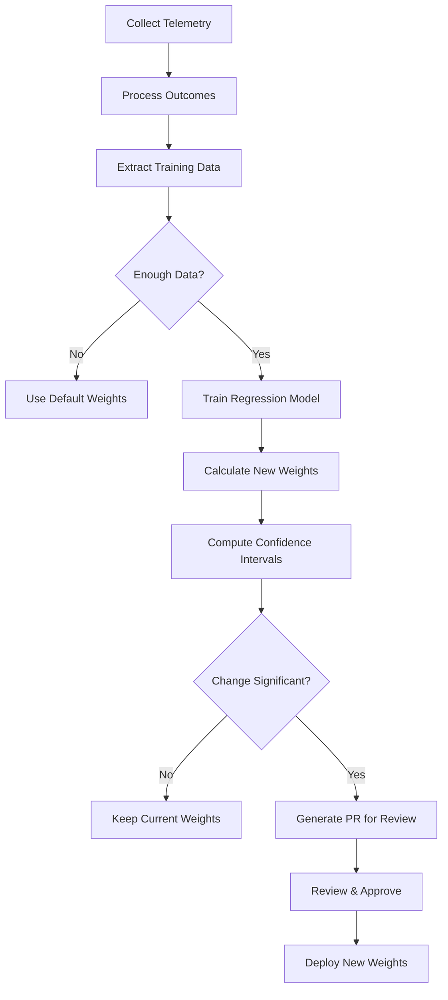

# CNS Calibration Plan with Telemetry Hooks

## Executive Summary

This document describes the telemetry hooks, weight calibration mechanism, and validation plan for the Context Neediness Score (CNS) system. The goal is to move from arbitrary weights (35/25/20/20) to data-driven calibration that correlates CNS with actual LLM verbalization quality outcomes.

---

## 1. CNS Overview

### Current Formula

```
CNS = SymbolAmbiguity(35) + StructuralComplexity(25) + 
      ArchitecturalSensitivity(20) + FeedbackDiscrepancy(20)
```

| Component | Weight | Range | Description |
|-----------|--------|-------|-------------|
| SymbolAmbiguity | 35 | 0-35 | How unclear/incomplete symbol documentation is |
| StructuralComplexity | 25 | 0-25 | Code complexity and external dependencies |
| ArchitecturalSensitivity | 20 | 0-20 | Domain module importance, cross-cutting concerns |
| FeedbackDiscrepancy | 20 | 0-20 | Historical user feedback patterns |

---

## 2. Telemetry Hooks Design

### 2.1 Telemetry Events

All telemetry is **opt-in** and **privacy-safe**. No source code or symbol contents are transmitted.

```kotlin
/**
 * CNS Telemetry Event Types
 */
sealed class CnsTelemetryEvent {
    data class CnsCalculated(
        val clusterId: String,
        val totalScore: Double,
        val symbolAmbiguity: Double,
        val structuralComplexity: Double,
        val architecturalSensitivity: Double,
        val feedbackDiscrepancy: Double,
        val symbolCount: Int,
        val timestamp: Long = System.currentTimeMillis()
    ) : CnsTelemetryEvent()

    data class StrategySelected(
        val clusterId: String,
        val cnsScore: Double,
        val recommendedStrategy: VerbalizationStrategy,
        val actualStrategyUsed: VerbalizationStrategy?,
        val timestamp: Long = System.currentTimeMillis()
    ) : CnsTelemetryEvent()

    data class LlmOutcome(
        val clusterId: String,
        val symbolId: String,
        val cnsScore: Double,
        val strategyUsed: VerbalizationStrategy,
        val originalDescription: String,
        val finalDescription: String,
        val llmConfidence: Double?,
        val feedbackRating: Int?, // 1-5 if user provided, null otherwise
        val wasCorrected: Boolean,
        val timestamp: Long = System.currentTimeMillis()
    ) : CnsTelemetryEvent()

    data class WeightAdjustment(
        val component: String,
        val oldWeight: Double,
        val newWeight: Double,
        val reason: String,
        val dataPointsUsed: Int,
        val confidenceInterval: DoubleRange,
        val timestamp: Long = System.currentTimeMillis()
    ) : CnsTelemetryEvent()
}
```

### 2.2 Telemetry Configuration

```kotlin
/**
 * Telemetry configuration for CNS calibration.
 */
data class CnsTelemetryConfig(
    val enabled: Boolean = false,           // Opt-in by default
    val exportIntervalMs: Long = 3600000,   // Export every hour
    val maxEventsBuffered: Int = 1000,      // Buffer limit
    val anonymizeClusterIds: Boolean = true, // Hash cluster IDs
    val exportEndpoint: String? = null,     // Optional remote endpoint
    val localExportPath: String? = null     // Optional local file
)

/**
 * Telemetry service for CNS calibration.
 */
class CnsTelemetryService(
    private val config: CnsTelemetryConfig = CnsTelemetryConfig()
) {
    private val eventBuffer = mutableListOf<CnsTelemetryEvent>()
    
    // Current weights (for tracking changes)
    private var currentWeights = mapOf(
        "SymbolAmbiguity" to 35.0,
        "StructuralComplexity" to 25.0,
        "ArchitecturalSensitivity" to 20.0,
        "FeedbackDiscrepancy" to 20.0
    )

    /**
     * Log CNS calculation event.
     */
    fun logCnsCalculated(
        clusterId: String,
        score: ClusterNeedinessScore,
        symbolCount: Int
    ) {
        if (!config.enabled) return
        
        val event = CnsTelemetryEvent.CnsCalculated(
            clusterId = anonymize(clusterId),
            totalScore = score.total,
            symbolAmbiguity = score.symbolAmbiguity.total,
            structuralComplexity = score.structuralComplexity.total,
            architecturalSensitivity = score.architecturalSensitivity.total,
            feedbackDiscrepancy = score.feedbackDiscrepancy.total,
            symbolCount = symbolCount
        )
        bufferEvent(event)
    }

    /**
     * Log strategy selection event.
     */
    fun logStrategySelected(
        clusterId: String,
        cnsScore: Double,
        recommended: VerbalizationStrategy,
        used: VerbalizationStrategy?
    ) {
        if (!config.enabled) return
        
        val event = CnsTelemetryEvent.StrategySelected(
            clusterId = anonymize(clusterId),
            cnsScore = cnsScore,
            recommendedStrategy = recommended,
            actualStrategyUsed = used
        )
        bufferEvent(event)
    }

    /**
     * Log LLM outcome with feedback correlation.
     */
    fun logLlmOutcome(
        clusterId: String,
        symbolId: String,
        cnsScore: Double,
        strategy: VerbalizationStrategy,
        original: String,
        final: String,
        llmConfidence: Double?,
        feedback: Feedback?
    ) {
        if (!config.enabled) return
        
        val event = CnsTelemetryEvent.LlmOutcome(
            clusterId = anonymize(clusterId),
            symbolId = symbolId,
            cnsScore = cnsScore,
            strategyUsed = strategy,
            originalDescription = hashString(original),
            finalDescription = hashString(final),
            llmConfidence = llmConfidence,
            feedbackRating = feedback?.rating,
            wasCorrected = feedback?.correction != null
        )
        bufferEvent(event)
    }

    /**
     * Log weight adjustment.
     */
    fun logWeightAdjustment(
        component: String,
        oldWeight: Double,
        newWeight: Double,
        reason: String,
        dataPoints: Int,
        confidence: ClosedFloatingPointRange<Double>
    ) {
        val event = CnsTelemetryEvent.WeightAdjustment(
            component = component,
            oldWeight = oldWeight,
            newWeight = newWeight,
            reason = reason,
            dataPointsUsed = dataPoints,
            confidenceInterval = confidence
        )
        currentWeights = currentWeights + (component to newWeight)
        bufferEvent(event)
    }

    private fun bufferEvent(event: CnsTelemetryEvent) {
        synchronized(eventBuffer) {
            eventBuffer.add(event)
            if (eventBuffer.size >= config.maxEventsBuffered) {
                flush()
            }
        }
    }

    private fun flush() {
        if (config.localExportPath != null) {
            exportToFile(config.localExportPath)
        }
        if (config.exportEndpoint != null) {
            exportToEndpoint(config.exportEndpoint)
        }
        eventBuffer.clear()
    }

    private fun anonymize(clusterId: String): String {
        return if (config.anonymizeClusterIds) {
            clusterId.hashCode().toString()
        } else {
            clusterId
        }
    }

    private fun hashString(s: String): String {
        // One-way hash for comparison without storing content
        return s.hashCode().toString()
    }
}
```

### 2.3 Integration Points

```kotlin
/**
 * Integration with ContextNeedinessCalculator.
 */
class TelemetryAwareCnsCalculator(
    private val delegate: ContextNeedinessCalculator,
    private val telemetry: CnsTelemetryService
) : ContextNeedinessCalculator(
    delegate.symbolRepository,
    delegate.verbalizationStore,
    delegate.feedbackStore,
    delegate.config
) {
    override suspend fun calculate(clusterId: String): ClusterNeedinessScore {
        val score = super.calculate(clusterId)
        val symbolCount = symbolRepository.getClusterSymbols(clusterId).size
        
        telemetry.logCnsCalculated(clusterId, score, symbolCount)
        return score
    }
}

/**
 * Integration with Strategy Selection.
 */
class TelemetryAwareStrategySelector(
    private val delegate: StrategySelector,
    private val telemetry: CnsTelemetryService
) {
    fun selectStrategy(
        clusterId: String,
        cnsScore: Double,
        recommended: VerbalizationStrategy,
        used: VerbalizationStrategy?
    ) {
        telemetry.logStrategySelected(clusterId, cnsScore, recommended, used)
        return delegate.select(clusterId, cnsScore, recommended, used)
    }
}
```

---

## 3. Current Heuristics Documentation

### 3.1 SymbolAmbiguity (0-35 points)

**Purpose:** Measures how unclear or incomplete symbol documentation is.

| Sub-component | Max Points | Heuristic Description |
|---------------|------------|----------------------|
| `lowConfidenceRatio` | 0-20 | Ratio of verbalizations with confidence < threshold. Higher ratio = more ambiguous symbols. Formula: `(lowConfidenceCount / symbolCount) * 20` |
| `duplicateNames` | 0-5 | Count of symbols sharing names across cluster. Indicates potential naming conflicts. Formula: `duplicateCount * penalty` |
| `missingDocumentation` | 0-10 | Count of symbols without verbalizations or with blank descriptions. Formula: `missingCount * penalty` |

**Validation Questions:**
- Is confidence threshold (0.7) appropriate?
- Do duplicate names really indicate ambiguity?
- Should we weight first-time vs persistent missing docs differently?

### 3.2 StructuralComplexity (0-25 points)

**Purpose:** Measures code complexity and external dependencies.

| Sub-component | Max Points | Heuristic Description |
|---------------|------------|----------------------|
| `cyclomaticComplexity` | 0-15 | Average cyclomatic complexity across symbols. Counts branching constructs: `if`, `when`, `for`, `while`, `catch`, `&&`, `||`, `?:` |
| `externalDependencies` | 0-10 | Ratio of external (non-i2vision) imports per symbol. Higher = more integration complexity. |

**Cyclomatic Complexity Calculation:**
```kotlin
// Base complexity
complexity = 1.0

// Add for each construct
+ 1.0 per if statement
+ 1.0 per when expression
+ 1.0 per for loop
+ 1.0 per while loop
+ 1.0 per catch block
+ 0.5 per && or ||
+ 1.0 per ternary operator
```

**Validation Questions:**
- Is regex-based complexity counting accurate vs AST-based?
- Should we count `?.let { }` chains?
- External imports: Which packages count as "external"?

### 3.3 ArchitecturalSensitivity (0-20 points)

**Purpose:** Measures domain module importance and cross-cutting concerns.

| Sub-component | Max Points | Heuristic Description |
|---------------|------------|----------------------|
| `domainModule` | 0-10 | Binary flag: 10 if cluster matches domain patterns, 0 otherwise. Patterns: "core", "domain", "business", "service", "orchestrator" |
| `crossCuttingFlows` | 0-10 | Count of cross-cutting patterns: logging, authentication, authorization, validation, caching, error handling, retry, circuit breaker |

**Validation Questions:**
- Is the domain module detection accurate?
- Are there more cross-cutting patterns to detect?
- Should cross-cutting be binary or weighted?

### 3.4 FeedbackDiscrepancy (0-20 points)

**Purpose:** Measures historical user feedback patterns.

| Sub-component | Max Points | Heuristic Description |
|---------------|------------|----------------------|
| `ratingDelta` | 0-10 | Average deviation from expected rating (3.0). Lower ratings = higher discrepancy. |
| `correctionFrequency` | 0-10 | Ratio of feedback entries with corrections. Higher = more verbalization errors. |

**Validation Questions:**
- Is 3.0 the right baseline for expected rating?
- Should we weight recent feedback more heavily?
- Are correction types (spelling vs content) distinguishable?

---

## 4. Weight Adjustment Mechanism

### 4.1 Logistic Regression Model

```kotlin
/**
 * Weight calibration using logistic regression on telemetry data.
 */
class CnsWeightCalibrator(
    private val telemetryData: List<LlmOutcomeTelemetry>
) {
    /**
     * Train weights to maximize correlation between CNS and outcome.
     * 
     * Model: P(success) = 1 / (1 + exp(-(b0 + b1*SA + b2*SC + b3*AS + b4*FD)))
     * 
     * Where:
     * - SA = SymbolAmbiguity score
     * - SC = StructuralComplexity score
     * - AS = ArchitecturalSensitivity score
     * - FD = FeedbackDiscrepancy score
     */
    data class TrainingData(
        val symbolAmbiguity: Double,
        val structuralComplexity: Double,
        val architecturalSensitivity: Double,
        val feedbackDiscrepancy: Double,
        val success: Boolean  // true if feedback rating >= 4 or !wasCorrected
    )

    /**
     * Train model using gradient descent.
     */
    fun train(
        data: List<TrainingData>,
        initialWeights: Map<String, Double> = DEFAULT_WEIGHTS
    ): CalibrationResult {
        // Prepare feature matrix and labels
        val X = data.map { row ->
            doubleArrayOf(
                1.0, // bias
                row.symbolAmbiguity,
                row.structuralComplexity,
                row.architecturalSensitivity,
                row.feedbackDiscrepancy
            )
        }
        val y = data.map { if (it.success) 1.0 else 0.0 }
        
        // Gradient descent
        var weights = doubleArrayOf(0.0, 1.0, 1.0, 1.0, 1.0) // scaled
        val learningRate = 0.01
        val iterations = 10000
        
        repeat(iterations) { epoch ->
            X.forEachIndexed { i, features ->
                val prediction = sigmoid(dotProduct(features, weights))
                val error = prediction - y[i]
                weights = weights.zip(features).map { (w, f) ->
                    w - learningRate * error * f
                }.toDoubleArray()
            }
        }
        
        // Normalize to 0-100 scale while preserving ratios
        val normalized = normalizeWeights(
            weights.drop(1).map { it * 25 } // Scale to ~25 per component
        )
        
        return CalibrationResult(
            weights = mapOf(
                "SymbolAmbiguity" to normalized[0],
                "StructuralComplexity" to normalized[1],
                "ArchitecturalSensitivity" to normalized[2],
                "FeedbackDiscrepancy" to normalized[3]
            ),
            modelFit = calculateR2(data, weights),
            confidenceIntervals = calculateConfidenceIntervals(data, weights),
            sampleSize = data.size
        )
    }
    
    private fun sigmoid(x: Double): Double = 1.0 / (1.0 + exp(-x))
    
    private fun dotProduct(a: DoubleArray, b: DoubleArray): Double =
        a.zip(b).sumOf { (x, y) -> x * y }
    
    private fun normalizeWeights(weights: List<Double>): List<Double> {
        val sum = weights.sum()
        return weights.map { (it / sum) * 100 }
    }
}

data class CalibrationResult(
    val weights: Map<String, Double>,
    val modelFit: Double, // R-squared value
    val confidenceIntervals: Map<String, ClosedFloatingPointRange<Double>>,
    val sampleSize: Int
)
```

### 4.2 Manual Weight Override

```yaml
# config/cns-weights.yaml
# Manual override for CNS weights
# Set to null to use calibrated weights

weights:
  SymbolAmbiguity: 35        # Default: 35, Calibrated: null
  StructuralComplexity: 25   # Default: 25, Calibrated: null
  ArchitecturalSensitivity: 20
  FeedbackDiscrepancy: 20

# Thresholds for strategy selection
thresholds:
  low: 30                    # Use DEFAULT strategy
  moderate: 50               # Use LEARNING strategy
  high: 70                   # Use MULTI_PASS strategy
```

```kotlin
/**
 * Configuration loader for CNS weights.
 */
class CnsWeightConfig(
    private val configPath: String = "config/cns-weights.yaml"
) {
    data class WeightConfig(
        val weights: Map<String, Double?>,
        val thresholds: Thresholds
    )
    
    data class Thresholds(
        val low: Double = 30.0,
        val moderate: Double = 50.0,
        val high: Double = 70.0
    )
    
    fun load(): WeightConfig {
        val file = File(configPath)
        return if (file.exists()) {
            parseYaml(file.readText())
        } else {
            WeightConfig(
                weights = mapOf(
                    "SymbolAmbiguity" to null,
                    "StructuralComplexity" to null,
                    "ArchitecturalSensitivity" to null,
                    "FeedbackDiscrepancy" to null
                ),
                thresholds = Thresholds()
            )
        }
    }
}
```

### 4.3 Weight Adjustment Workflow



---

## 5. Calibration Plan

### Phase 1: Telemetry Collection (Weeks 1-2)

**Goal:** Collect baseline telemetry data.

**Tasks:**
- [ ] Implement telemetry hooks (2.1-2.3)
- [ ] Add opt-in configuration flag
- [ ] Set up local export path
- [ ] Document privacy guarantees
- [ ] Deploy to staging environment

**Success Criteria:**
- 1000+ CNS calculations logged
- 100+ feedback correlations captured
- No source code in telemetry exports

### Phase 2: Data Analysis (Weeks 3-4)

**Goal:** Analyze collected data for weight validation.

**Tasks:**
- [ ] Export telemetry from staging
- [ ] Calculate component correlations with outcomes
- [ ] Identify outliers and edge cases
- [ ] Document current weight accuracy
- [ ] Generate initial calibration recommendations

**Analysis Questions:**
- Which component best predicts LLM success?
- Are current weights correlated with outcomes?
- Which edge cases need special handling?

### Phase 3: Weight Calibration (Weeks 5-6)

**Goal:** Implement and test weight adjustments.

**Tasks:**
- [ ] Implement logistic regression (4.1)
- [ ] Add manual override config (4.2)
- [ ] Run backtesting on historical data
- [ ] Calculate confidence intervals
- [ ] Document new recommended weights

**Success Criteria:**
- Model R² > 0.3
- Confidence intervals < ±5 points
- Backtest accuracy > 70%

### Phase 4: Deployment (Weeks 7-8)

**Goal:** Deploy calibrated weights to production.

**Tasks:**
- [ ] Generate change proposal document
- [ ] PR review with data evidence
- [ ] Gradual rollout (10% → 50% → 100%)
- [ ] Monitor metrics during rollout
- [ ] Rollback plan ready

**Rollback Triggers:**
- Strategy selection accuracy drops > 10%
- User complaints increase > 2x baseline
- Latency impact > 50ms p99

---

## 6. Metrics and Success Criteria

### 6.1 Primary Metrics

| Metric | Current | Target | Measurement |
|--------|---------|--------|-------------|
| CNS-Outcome Correlation | Unknown | > 0.5 | Pearson correlation |
| Strategy Selection Accuracy | Unknown | > 80% | % of clusters where recommended strategy matches outcome |
| Weight Calibration R² | N/A | > 0.3 | Model fit on telemetry data |
| Calibration Confidence | N/A | ±5 points | 95% CI width |

### 6.2 Secondary Metrics

| Metric | Description | Target |
|--------|-------------|--------|
| Telemetry Coverage | % of clusters with telemetry | > 50% |
| Feedback Capture Rate | % of verbalizations with feedback | > 10% |
| Calibration Stability | Weight change frequency | < 1x per quarter |

---

## 7. Appendix

### A. Telemetry Privacy Impact Assessment

| Data Type | Stored | Exported | Anonymized |
|-----------|--------|----------|------------|
| Cluster ID | Yes | Opt-in | Hash |
| Symbol Names | Yes | No | N/A |
| Symbol Content | No | No | N/A |
| Verbalization Text | Hash only | No | Hash |
| File Paths | Prefix only | No | Prefix |

### B. Default Weights Reference

```
SymbolAmbiguity: 35.0
StructuralComplexity: 25.0
ArchitecturalSensitivity: 20.0
FeedbackDiscrepancy: 20.0
Total: 100.0
```

### C. Related Documentation

- [Context Neediness Calculator](../api.md#contextneedinesscalculator)
- [Feedback Store](./feedback-store.md)
- [Verbalization Strategies](./strategies.md)
- [Configuration Guide](../guides/configuration.md)

---

*Document Version: 1.0*
*Last Updated: 2026-05-14*
*Owner: Verbalization Core Team*