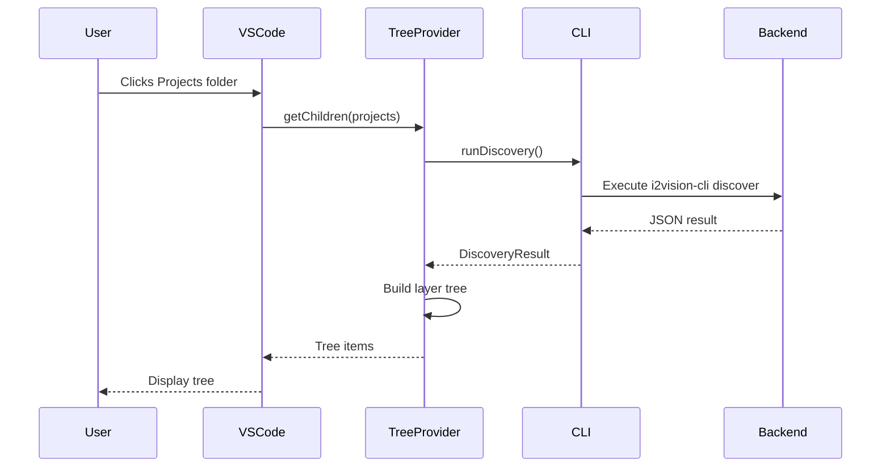
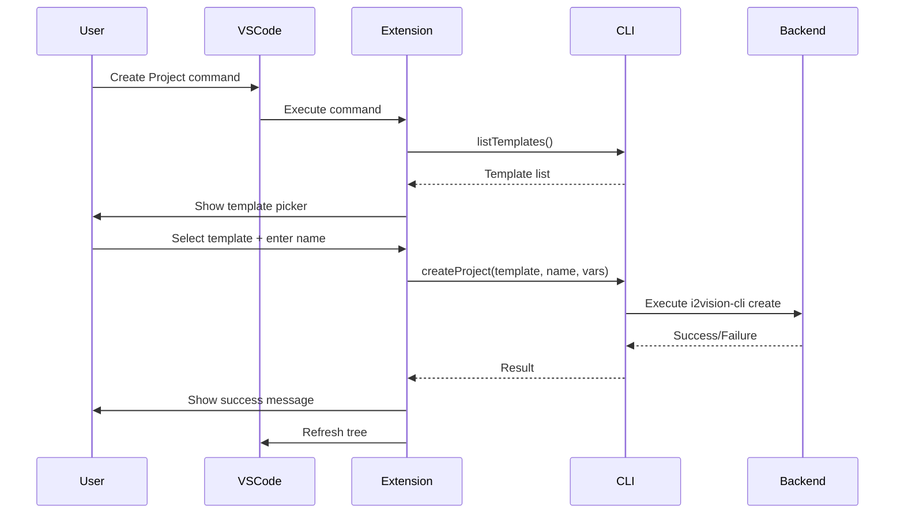

# CLI Integration Guide

## 🎯 Overview

The i2-Vision VSCode extension now integrates with the **i2vision CLI backend** for real-time code discovery, architecture analysis, and project management.

## 📦 New Components

### 1. CLI Integration Layer (`src/cliIntegration.ts`)

**Purpose**: Bridge between VSCode extension and i2vision CLI

**Key Classes:**
- `I2VisionCLI` - Main CLI wrapper with mock data fallback

**Methods:**
```typescript
class I2VisionCLI {
  // Discovery
  runDiscovery(): Promise<DiscoveryResult>
  
  // Context extraction
  getContext(filePath: string): Promise<VSLFContext>
  
  // Templates
  listTemplates(): Promise<TemplateInfo[]>
  createProject(template, name, variables): Promise<boolean>
  
  // Analysis
  analyzeViolations(): Promise<Violation[]>
  
  // Utility
  isAvailable(): Promise<boolean>
}
```

**Interfaces:**
- `DiscoveryResult` - Project structure with components, layers, relationships
- `ComponentInfo` - Individual component metadata
- `Relationship` - Dependencies between components
- `LayerInfo` - Architecture layer definitions
- `Violation` - Architecture rule violations
- `VSLFContext` - File-level context and metrics
- `TemplateInfo` - Project template definitions

### 2. Enhanced Tree Provider (`src/treeViewProvider.ts`)

**Purpose**: Dynamic tree view powered by CLI discovery data

**Key Features:**
- Real-time discovery results display
- Layer-based component grouping
- Violation warnings with severity indicators
- Template browsing with variable details
- Cached data for performance

**Tree Structure:**
```
i2-Vision Explorer
├── Projects
│   └── i2-vision v1.0.0
│       ├── presentation (2)
│       │   └── vscode-app
│       ├── application (2)
│       │   └── app
│       │   └── DiscoveryService
│       ├── infrastructure (2)
│       │   └── storage-core
│       │   └── index-provider
│       └── ⚠️ Violations (0)
├── Templates
│   ├── Basic Template (basic)
│   ├── Advanced Template (advanced)
│   ├── Enterprise Template (enterprise)
│   └── Microservice Template (microservice)
├── Settings
│   ├── Extension Settings
│   ├── CLI Configuration
│   └── Architecture Rules
└── Documentation
    ├── Quick Start Guide
    ├── Architecture Documentation
    ├── API Reference
    └── GitHub Repository
```

### 3. Updated Extension Entry Point (`src/extension.ts`)

**New Commands:**
- `i2vision.showDiscovery` - Display discovery results in output
- `i2vision.analyzeArchitecture` - Run architecture analysis
- `i2vision.viewDocumentation` - Quick access to docs
- `i2vision.openFile` - Open files from tree items

**Features:**
- Automatic CLI availability detection
- Output channel for logging
- Welcome message on activation
- Error handling with user-friendly messages

## 🔧 How It Works

### Discovery Flow



### Command Flow



## 🛠 Building the CLI Backend

### Prerequisites

1. **Java 21+** installed
2. **Gradle 8+** available
3. **Kotlin** project built

### Build Steps

```bash
# Navigate to project root
cd D:/proj/AI/i2-vision

# Build the CLI module
./gradlew :i2vision-cli:build

# Install CLI to local system
./gradlew :i2vision-cli:installDist

# Verify installation
./i2vision-cli/build/install/i2vision-cli/bin/i2vision-cli version
```

### Add to PATH

**Windows:**
```powershell
# Add to user PATH
$cliPath = "D:\proj\AI\i2-vision\i2vision-cli\build\install\i2vision-cli\bin"
[Environment]::SetEnvironmentVariable(
    "PATH",
    $env:PATH + ";" + $cliPath,
    "User"
)
```

**Linux/macOS:**
```bash
export PATH="$PATH:/path/to/i2-vision/i2vision-cli/build/install/i2vision-cli/bin"
```

## 🧪 Testing

### Unit Tests

```bash
cd vscode-app
npm test
```

**Test Coverage:**
- CLI integration methods
- Tree provider functionality
- Command registration
- Data structure validation

### Manual Testing

1. **Launch Extension:**
   ```bash
   # Open vscode-app in VSCode
   code vscode-app
   
   # Press F5 to launch Extension Development Host
   ```

2. **Test Discovery:**
   - Click on "Projects" in tree view
   - Verify components are displayed
   - Check layer grouping
   - Look for violations (if any)

3. **Test Templates:**
   - Click on "Templates" folder
   - Expand template items
   - Verify variables are shown

4. **Test Commands:**
   ```bash
   # Open Command Palette (Ctrl+Shift+P)
   # Run: i2-Vision: Show Discovery Results
   # Run: i2-Vision: Analyze Architecture
   # Run: i2-Vision: Create New Project
   ```

5. **Check Output Channel:**
   - View → Output
   - Select "i2-Vision" from dropdown
   - Verify logging messages

## 📊 Mock Data vs Real Data

### Development Mode (Mock Data)

When CLI is not available, the extension uses **mock data**:

```typescript
// Mock discovery result
{
  projectName: 'i2-vision',
  version: '1.0.0',
  components: [
    { name: 'app', type: 'module', layer: 'application' },
    { name: 'storage-core', type: 'module', layer: 'infrastructure' },
    { name: 'vscode-app', type: 'module', layer: 'presentation' }
  ],
  layers: [
    { name: 'presentation', level: 3 },
    { name: 'application', level: 2 },
    { name: 'infrastructure', level: 1 }
  ]
}
```

### Production Mode (Real Data)

When CLI is available, real discovery data is used:

```bash
# CLI command executed
i2vision-cli discover --json --dir "workspace-root"

# Real output based on actual codebase analysis
```

## 🎨 Tree Item Metadata

Each tree item carries metadata for context:

```typescript
interface I2VisionTreeItem {
  label: string;
  itemType: TreeItemType;
  metadata?: {
    component?: ComponentInfo;
    layer?: LayerInfo;
    template?: TemplateInfo;
    version?: string;
  };
  children: I2VisionTreeItem[];
  command?: Command;
  iconPath: ThemeIcon | string;
  tooltip: string;
  description: string;
}
```

## 🔍 Output Channel Logging

All CLI operations are logged:

```
[12:34:56] i2-Vision extension activated
[12:34:56] Workspace: D:/proj/AI/i2-vision
[12:34:57] Running discovery...
[12:34:58] Discovery complete: 6 components found
[12:34:59] ✅ i2vision CLI is available
```

## ⚠️ Error Handling

### CLI Not Available
```
⚠️ i2vision CLI not found - using mock data
To enable full functionality, build the i2vision-cli module:
  ./gradlew :i2vision-cli:installDist
```

### Discovery Error
```
Discovery error: Command failed
Falling back to mock data
```

### Project Creation Error
```
Failed to create project: Template not found
```

## 🚀 Next Steps

### Immediate Enhancements
1. **File System Integration**: Open actual files from tree items
2. **Project Creation Wizard**: Full UI for template variables
3. **Violation Quick Fixes**: Click to fix architecture violations

### Medium-Term Features
1. **Webview Architecture Diagram**: Mermaid.js visualization
2. **Status Bar Integration**: Show analysis status
3. **CodeLens**: Show layer info in editor

### Long-Term Vision
1. **LSP Integration**: Go-to-definition based on architecture
2. **AI Chat Panel**: Context-aware codebase questions
3. **Real-time Analysis**: Background discovery updates

## 📝 Troubleshooting

### Tree View Empty
**Solution:** Click refresh button or check output channel for errors

### CLI Not Found
**Solution:** Build and install CLI, add to PATH

### Mock Data Showing
**Solution:** This is normal in development. Build CLI for real data.

### Compilation Errors
**Solution:** Run `npm install` and check TypeScript version

### Tests Failing
**Solution:** Ensure extension is compiled and VSCode version is compatible

## 📚 Related Documentation

- [Quick Start Guide](QUICKSTART.md) - Getting started
- [README](README.md) - Full documentation
- [CHANGELOG](CHANGELOG.md) - Version history

## 🎉 Success Indicators

✅ Extension compiles without errors  
✅ Tree view shows Projects, Templates, Settings, Documentation  
✅ Clicking Projects shows discovery data (mock or real)  
✅ Output channel shows logging messages  
✅ Commands execute without errors  
✅ Tests pass  

---

**Happy integrating! 🚀**
