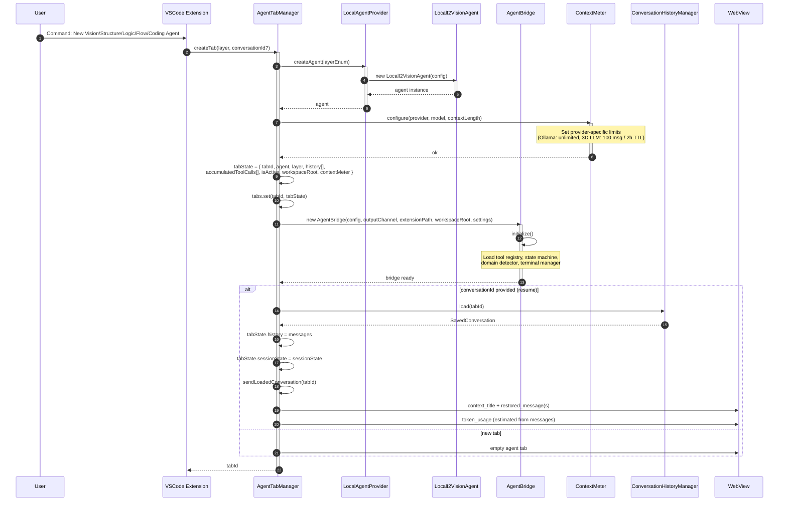
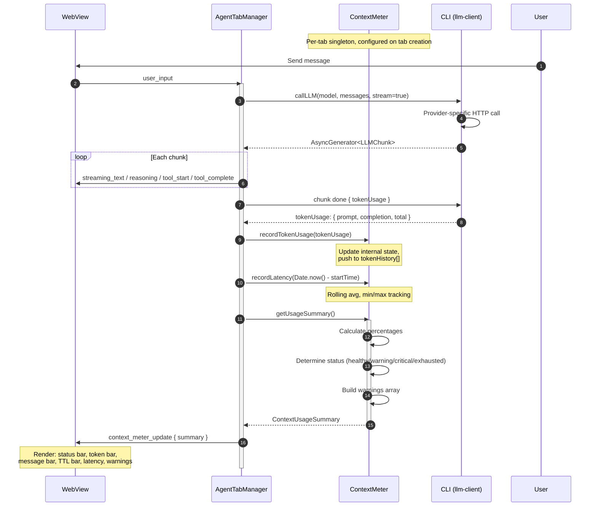
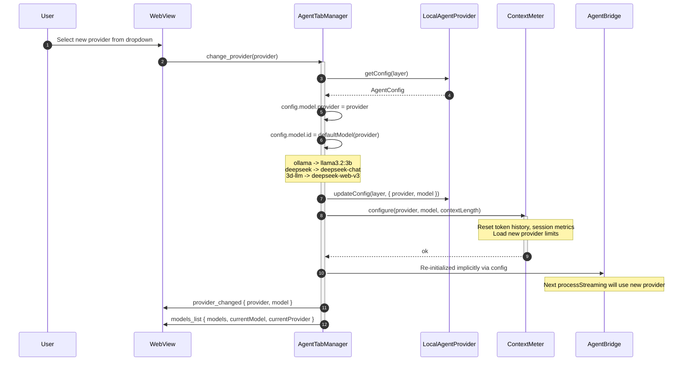
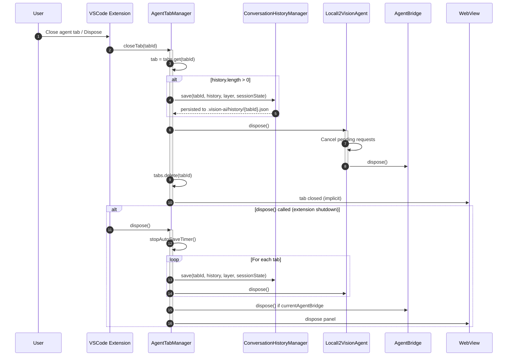
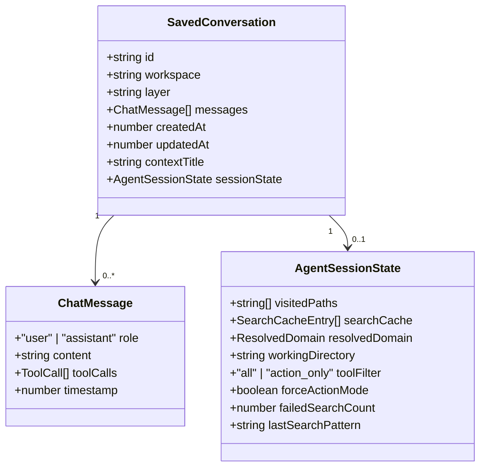
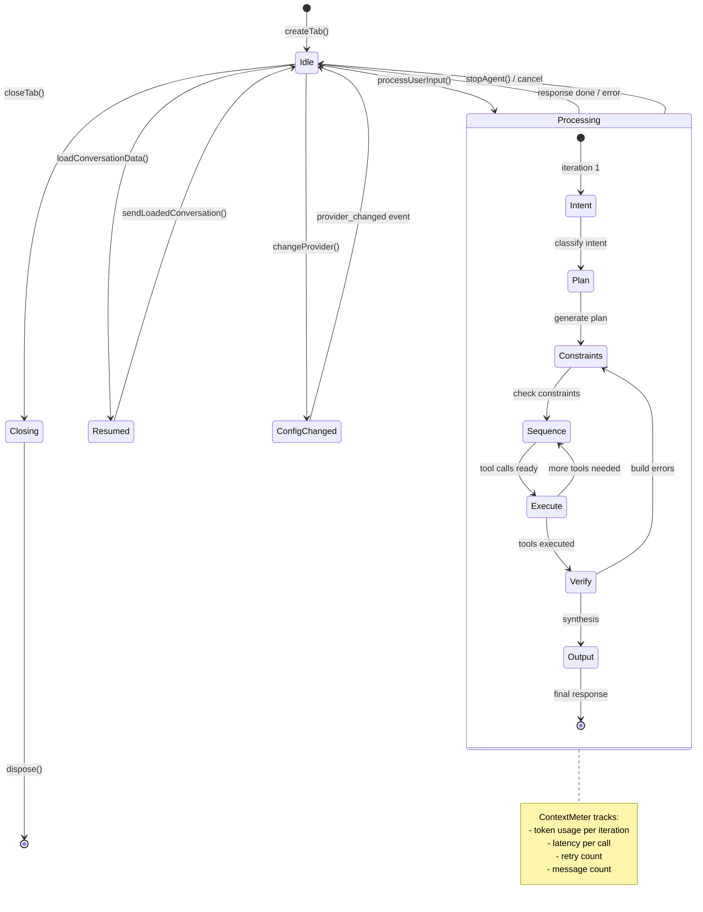
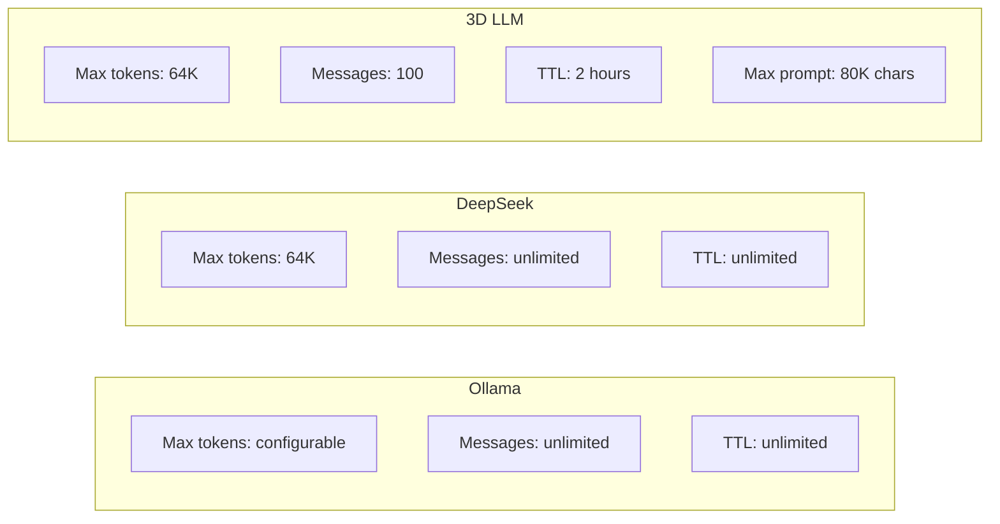

# Agent Session Sequence Flow

This document describes the complete lifecycle of an i2-Vision agent session, from tab creation through user input processing to persistence and cleanup.

## Legend

| Symbol | Meaning |
|--------|---------|
| `->`  | Synchronous call |
| `-->>` | Return value |
| `->>` | Asynchronous/fire-and-forget |
| `activate` / `deactivate` | Object lifetime scope |

---

## 1. Tab Creation Flow



---

## 2. User Input Processing Flow

```mermaid
sequenceDiagram
    autonumber
    participant User
    participant WebView
    participant ATM as AgentTabManager
    participant AB as AgentBridge
    participant SM as StateMachine
    participant DD as DomainDetector
    participant LLM as LLM Provider<br/>(Ollama / DeepSeek / 3D LLM)
    participant TR as ToolRegistry
    participant CM as ContextMeter
    participant CHM as ConversationHistoryManager

    User->>WebView: Type message + Send
    WebView->>ATM: user_input(content, currentFile)
    activate ATM

    Note over ATM: isProcessing = true
    ATM->>ATM: history.push(userMessage)
    ATM->>WebView: user_message

    ATM->>AB: processStreaming(userInput, currentFile, history, sessionState)
    activate AB
    AB->>AB: restoreSessionState(sessionState)
    Note over AB: Restore visitedPaths, searchCache,<br/>domainResolution, toolFilter

    AB->>AB: buildSystemPrompt(templateVars)
    AB->>DD: resolveDomain(userInput)
    DD-->>AB: DomainResolution
    AB->>AB: injectDomainHint(systemPrompt)

    AB->>AB: detectTaskType(userInput)
    AB->>AB: loadEagerContext(contextProfile, currentFile)
    AB->>AB: injectContextIntoPrompt(systemPrompt, loadedContext)

    AB->>AB: buildMessages(systemPrompt, history, userInput)
    Note over AB: [system, history..., user]

    AB->>AB: executeAgentLoop(messages, options, history)
    activate AB

    loop While iteration < maxIterations
        AB->>SM: dispatch(USER_INPUT)
        AB->>SM: dispatch(INTENT_CLASSIFIED)
        AB->>SM: dispatch(PLAN_GENERATED)
        AB->>SM: dispatch(CONSTRAINTS_CHECKED)

        AB->>LLM: callLLM(modelId, messages, tools)
        activate LLM
        LLM-->>AB: LLMResponse { content, toolCalls }
        deactivate LLM

        alt Tool calls present
            AB->>TR: execute(toolName, args)
            activate TR
            TR-->>AB: ToolResult
            deactivate TR
            AB->>WebView: tool_start / tool_complete (via ATM relay)
            AB->>SM: dispatch(TOOL_EXECUTED)
            AB->>AB: messages.push(tool_result)
        else No tools (synthesis)
            AB->>SM: dispatch(SYNTHESIS_STARTED)
            AB->>AB: finalResponse = content
            AB->>SM: dispatch(OUTPUT_VERIFIED)
            break
        end
    end

    AB->>AB: getSessionState()
    AB-->>AB: AgentSessionState
    AB-->>ATM: yield done { tokenUsage }
    deactivate AB

    ATM->>CM: recordTokenUsage(prompt, completion, total)
    ATM->>CM: recordLatency(durationMs)
    ATM->>CM: getUsageSummary()
    CM-->>ATM: ContextUsageSummary

    alt warnings present
        ATM->>ATM: log warnings
    end

    ATM->>WebView: token_usage (legacy)
    ATM->>WebView: context_meter_update { summary }

    ATM->>ATM: history.push(assistantMessage)
    ATM->>ATM: tabState.sessionState = bridge.getSessionState()

    alt autoSave enabled
        ATM->>CHM: save(tabId, messages, layer, sessionState)
    end

    ATM->>WebView: assistant_response
    Note over ATM: isProcessing = false
    deactivate ATM
```

---

## 3. Context Meter Data Flow



---

## 4. Provider Change Flow



---

## 5. Tab Close / Cleanup Flow



---

## 6. Streaming Chunk Types

```mermaid
graph LR
    AB[AgentBridge<br/>executeAgentLoop]
    ATM[AgentTabManager<br/>processUserInput]
    WV[WebView

    AB -->|AgentChunk| ATM
    ATM -->|WebView message| WV

    subgraph AgentChunk Types
        C1["reasoning: string"]
        C2["tool_call_started: { toolName, args }"]
        C3["tool_call_completed: { toolName, result }"]
        C4["text: string"]
        C5["done: { tokenUsage? }"]
        C6["error: string"]
        C7["thinking: string"]
    end

    subgraph WebView Commands
        W1["reasoning"]
        W2["tool_start"]
        W3["tool_complete"]
        W4["streaming_text"]
        W5["token_usage"]
        W6["context_meter_update"]
        W7["error"]
        W8["thinking"]
        W9["assistant_response"]
    end

    C1 --> W1
    C2 --> W2
    C3 --> W3
    C4 --> W4
    C5 --> W5
    C5 --> W6
    C6 --> W7
    C7 --> W8
```

---

## 7. Data Persistence Format



---

## 8. State Transitions



---

## 9. Provider-Specific Context Limits



| Provider | Context Meter Shows |
|----------|---------------------|
| Ollama | Tokens + Latency only |
| DeepSeek | Tokens + Latency only |
| 3D LLM | Tokens + Messages + TTL + Latency |

---

## File Responsibilities

| File | Responsibility |
|------|---------------|
| `AgentTabManager.ts` | Tab lifecycle, user input routing, webview coordination, proxy health polling |
| `AgentBridge.ts` | LLM calls, tool execution, state machine, session state, retry logic |
| `LocalI2VisionAgent.ts` | In-process agent instance, request processing |
| `LocalAgentProvider.ts` | Config loading, agent factory |
| `ConversationHistoryManager.ts` | File-based persistence (.vision-ai/history/*.json) |
| `ContextMeter.ts` | Token/session/latency tracking, limit warnings |
| `SessionManager.ts` | Interface for provider-specific session lifecycle |
| `ProxySessionManager.ts` | 3D LLM session sync, proactive reset, health checks |
| `ToolResultCompressor.ts` | Proactive compression of tool outputs before LLM send |
| `cliIntegration.ts` | HTTP LLM clients (Ollama, DeepSeek, 3D LLM) |
| `webview.js` | WebView UI, message handlers, context meter rendering |
| `agent-tab.html` | HTML template with placeholders for provider/model, proxy dashboard panel |
