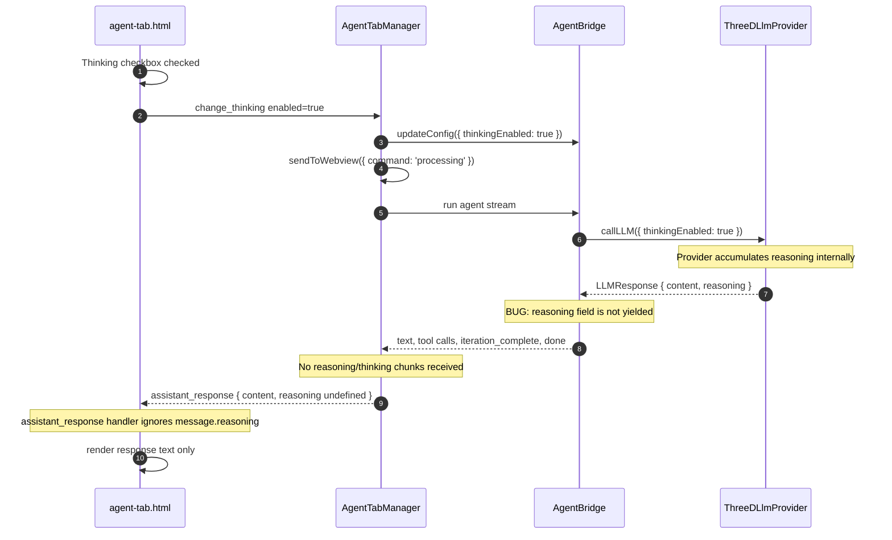
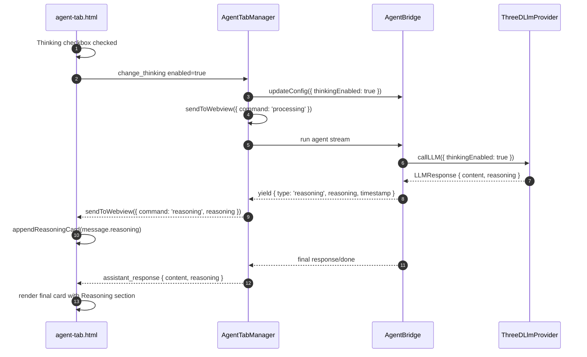

# Thinking Stream Flow Analysis

## Purpose
Analyze why the Agent output card shows only Processing and no Thinking/reasoning stream.

## Verified production path

The live Agent tab is loaded from `vscode-app/resources/agent-tab.html`. Its rendering logic is inline JavaScript inside that HTML file.

`vscode-app/resources/webview.js` is a separate webview path and does not render this output-card flow.

## Current broken sequence



Result: the only visible card is the initial Processing card.

## Target sequence



## Current handlers in agent-tab.html

```js
case 'thinking': showThinkingIndicator(message.message); break;
case 'reasoning': appendReasoningCard(message.reasoning); break;
case 'assistant_response':
  if (!streamingElement && message.content) appendStreamingText(message.content);
  finalizeStreamingText(message.durationMs);
  setProcessingState(false);
  break;
```

`thinking` shows only a transient indicator. `reasoning` can append a reasoning card. `assistant_response` renders only `message.content`, not `message.reasoning`.

## Thinking checkbox meaning

The footer Thinking checkbox sends `change_thinking`. The extension updates `agentConfig.model.thinkingEnabled`, `agentProvider.updateConfig`, and `currentAgentBridge.updateConfig`.

AgentBridge passes `thinkingEnabled` to `llmAdapter.callLLM`.

So the checkbox only allows the provider/model to request thinking tokens. It does NOT toggle display of the thinking stream and does NOT toggle `i2vision.output.showReasoning`.

## Root cause summary

| Layer | Status |
|---|---|
| ThreeDLlmProvider captures LLMResponse.reasoning | Works |
| AgentBridge yields reasoning stream event | Missing |
| AgentTabManager sends reasoning command to webview | Sends thinking instead of reasoning |
| agent-tab.html renders live reasoning card | Handler exists but is never triggered |
| agent-tab.html renders final Reasoning section in output card | Missing |
| Footer Thinking checkbox | Wired to provider/model config only |

## Implementation steps

1. `AgentBridge.ts`
   - After `callLLM()` returns the LLM response, if `llmResponse.reasoning` is truthy, add:
   ```ts
   yield {
     type: 'reasoning',
     reasoning: llmResponse.reasoning,
     timestamp: Date.now(),
   };
   ```

2. `AgentTabManager.ts`
   - In `case 'reasoning':`, send `command: 'reasoning'`, not `command: 'thinking'`:
   ```ts
   case 'reasoning':
     this.sendToWebview({ command: 'reasoning', reasoning: chunk.reasoning, timestamp: chunk.timestamp });
     accumulatedReasoning += chunk.reasoning;
     break;
   ```
   - Keep the existing `case 'thinking':` for the transient spinner/indicator.
   - Verify the final assistant message and webview `assistant_response` still include `accumulatedReasoning.trim() || undefined`.

3. `agent-tab.html`
   - Update `case 'assistant_response':` so that when `message.reasoning` is present, a Reasoning section is rendered above the response text. Reuse `appendReasoningCard(message.reasoning)` or add an equivalent persistent section inside the final card.
   - Keep the existing `case 'reasoning': appendReasoningCard(...)` so a live reasoning stream appears while the model is generating.

4. Mark non-production paths
   - `resources/webview.js` and `src/webview/components/AgentOutputCard.ts` are not part of this live output-card path. Avoid further patches there for this issue.

## Verification

1. Enable the footer Thinking checkbox.
2. Send a prompt that produces reasoning.
3. Expected:
   - Live reasoning card appears during the stream.
   - Final output card includes a Reasoning section above the response text.
4. Run `npm run compile` and reload the extension host/webview.
