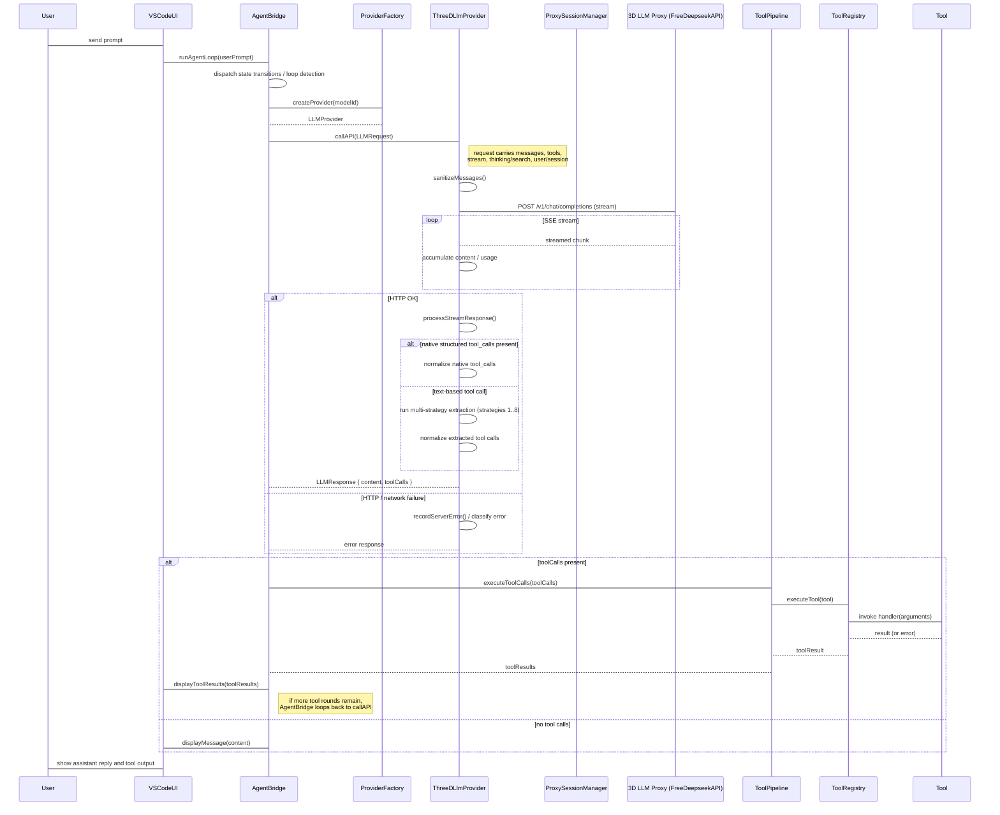

# 3D LLM Tool-Call and Extraction Flow

This diagram reflects the current implementation in `src/providers/3dllm/ThreeDLlmProvider.ts`.
The old CLI-based extraction path (`cliIntegration.ts`) has been replaced by provider-level
multi-strategy parsing.

## Notes

- `nativeToolCalls: true` for 3D LLM is prompt-emulated by the proxy; the provider
  still runs text-based extraction as a fallback when structured `tool_calls` are absent.
- The provider performs request sanitization before sending messages to the proxy.
- Tool-call extraction now uses shared helpers in `src/providers/common/toolCalls.ts`:
  native `tool_calls` normalization, canonical text fallback extraction, and tool-result compaction.
  Legacy proxy-specific fallback remains for 3D LLM compatibility.
- Prompt assembly is layered via `PromptAssembler` / `PromptPart` before messages reach the
  provider. Core rules, project context, and tool protocol are injected only when needed,
  avoiding rule/tool-catalog duplication on every request.
- Timeout / abort and server-error cooldown are handled inside `ThreeDLlmProvider`.
